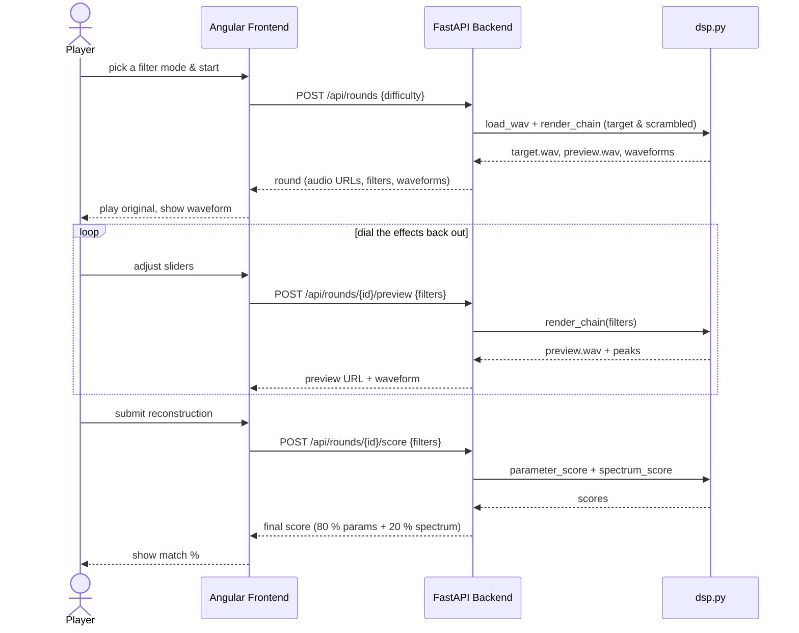

# DIAL IN

**DIAL IN** is a 90s-CRT-styled audio puzzle game. The Python backend takes a short audio clip and scrambles it with a random chain of *real* DSP effects (4-band EQ, chorus, echo, distortion); the player then turns sliders to dial those effects back out and reconstruct the original. Every preview and the final score are produced by the backend rendering the actual processed audio — the Angular frontend only drives the UI. A match score (80 % parameter accuracy + 20 % spectral similarity) rates how close the reconstruction is.

Stack: **Angular 21** (three.js / anime.js) frontend · **FastAPI + numpy/scipy** backend.

## How to start

From the project root, in **PowerShell**:

```powershell
# First run — installs backend (pip) and frontend (npm) dependencies, then starts:
./start.ps1 -Install

# Subsequent runs:
./start.ps1
```

This opens two windows:

- **Backend** — FastAPI / uvicorn on <http://localhost:8000> (health check: `/api/health`)
- **Frontend** — Angular dev server on <http://localhost:4200>

> **Note — Python virtual environment.** The backend needs `numpy`, `scipy`, `fastapi` and `uvicorn`. A virtual environment is recommended and may be required (e.g. if your global Python is restricted). Create and activate `.venv` **before** running the script, so `-Install` installs into it:
>
> ```powershell
> python -m venv .venv
> .\.venv\Scripts\Activate.ps1
> ```

## The DSP core — `server/app/dsp.py`

[`server/app/dsp.py`](server/app/dsp.py) is the signal-processing core (and the graded heart of the project). It implements the entire effect chain from scratch on numpy/scipy: a **4-band FIR equalizer** (windowed-sinc, linear phase), a **chorus** (LFO-modulated fractional delay), an **echo** (feedback comb / IIR), and a **tanh distortion** (soft-clip waveshaper) — plus WAV loading/normalisation and the FFT-based spectrum score. The math is documented inline for reference. All four filters sit at the bottom of the file under the `# Filter down below` marker; the helper, I/O and scoring functions are at the top.

## DSP documentation (animations)

[`docs/dial_in_manim.py`](docs/dial_in_manim.py) renders animated explanations of the four filters, the request pipeline and the scoring, built with [Manim](https://www.manim.community/) (installed in the `.venv`).

```powershell
# Full presentation (1080p):
python -m manim -pqh docs/dial_in_manim.py DialInApiPresentation

# Single scene, quick low-quality preview (e.g. the EQ):
python -m manim -pql docs/dial_in_manim.py Eq4Scene
```

Available scenes: `ApiFlowScene`, `Eq4Scene`, `ChorusScene`, `EchoScene`, `DistortionScene`, `ScoreScene`.

## Sequence


